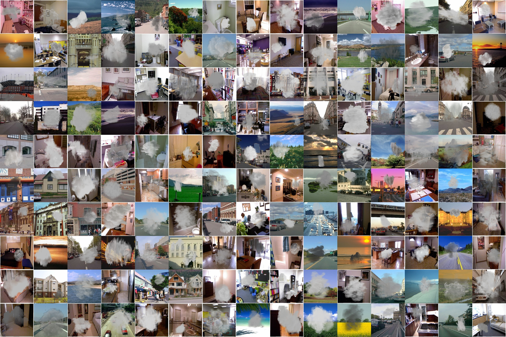

<!--  -->

# About

您好，我是鄭翔尹，今年畢業於元智大學資訊工程所博士班。在學期間，發表2篇IEEE國際期刊論文和3篇IEEE國際會議論文；並參與5個研究計畫和3個產學合作計畫。主要的研究方向是電腦視覺，和深度學習；並了解物件偵測，監督與非監督式學習，強化學習...等方面知識。

My name is Cheng Hsiang-Yin. I have passion in computer science. This passion carried me through my education at Yuan-Ze University. My Ph.D. studies have provided me with broad proficiency in the use of computer science engineering methods, techniques, and tools. Alongside this, I experienced computer programmer with academic experience that has published 2 IEEE journal articles, 3 conference articles, and participated in 5 research projects, 3 industry-university cooperation projects.

My research interests are in the broad area of computer vision, artificial intelligence, and image processing. Specifically, I have extensive experience in the following research areas: object recognition and detection, machine learning, deep learning, supervised and unsupervised learning, image super-resolution, and able to write the following specialties languages: Python, Matlab, C++, and Java.


## Skill

### Programming Languages
- Python (approx. 5+ years experience. Mainly used.)
- Matlab (approx. 3+ years experience.)
- C++ (approx. 1+ years experience.)
- Java (approx. 1+ years experience.)

### Deep Learning
- Familiar with deep learning frameworks like：TensorFlow、Keras、Scikit Learn.
- Familiar with deep learning techniques like：CNN、RNN、GAN、DQN、A2C、A3C.
- Experience with deep learning applications like：
  - Object Detection & Recognition
  - Object Localization
  - Object Classification
  - Semantic Segmentation ... and so on.

## Details
We contribute **Smoke100k** database, a large-scale smoke detection database, which has several appealing properties:

- **Smoke100k** consists of **100k** synthesized smoke image, smoke free image, smoke mask, and bounding box positions.

- There are **3** subsets of synthesized smoke images for simulation of different smoldering fires as follows:
  - _Smoke100k-L_: samples are synthesized by smoke masks selected from the **Low** level with twenty kinds of angles,
  - _Smoke100k-M_: samples are synthesized by smoke masks selected from the **Middle** level with eight kinds of angles,
  - _Smoke100k-H_: samples are synthesized by smoke masks selected from the **High** level with fifteen kinds of angles.

For more details of the dataset, please refer to the paper [Smoke 100k: A Database for Smoke Detection](https://ieeexplore.ieee.org/document/9015309).

## Sample Images

## Download

* Paper [[PDF, 156KB]](https://ieeexplore.ieee.org/document/9015309)
* Smoke100k [[Google Drive]](https://drive.google.com/drive/folders/1a3C010h7zzNPomMpddb74X3GffZx-R9C?usp=sharing) [[Baidu Drive]](https://pan.baidu.com/s/1viTqeu4rdCK5CtEvtQkFug) (password: ahsz)

## Agreement
* The **Smoke100k** dataset is available for non-commercial research purposes only.
* All images of the **Smoke100k** dataset are obtained from the LabelMe dataset [1], NYU dataset [2] which are not property of BigMMS Laboratory, Yuan Ze University. The BigMMS Laboratory is not responsible for the content nor the meaning of these images.
* You agree not to reproduce, duplicate, copy, sell, trade, resell or exploit for any commercial purposes, any portion of the images and any portion of derived data.
* You agree not to further copy, publish or distribute any portion of the **Smoke100k** dataset. Except, for internal use at a single site within the same organization it is allowed to make copies of the dataset.
* The BigMMS Laboratory reserves the right to terminate your access to the **Smoke100k** dataset at any time.

## Citation
If you find **Smoke100k** useful for your research, please cite our paper:

```
@INPROCEEDINGS{cheng_gcce19_smoke100k,  
author={H. {Cheng} and J. {Yin} and B. {Chen} and Z. {Yu}}, 
booktitle={IEEE 8th Global Conference on Consumer Electronics (GCCE)},   
title={Smoke 100k: A Database for Smoke Detection},  
year={2019}, 
volume={}, 
number={},  
pages={596-597}, 
doi={10.1109/GCCE46687.2019.9015309}}
```

## References
[1] B. C. Russell, A. Torralba, K. P. Murphy, and W. T. Freeman, "Labelme: A database and web-based tool for image annotation," International Journal of Computer Vision (IJCV), vol. 77, no. 1, pp. 157–173, May 2008.

[2] P. K. Nathan Silberman, Derek Hoiem and R. Fergus, "Indoor segmentation and support inference from rgbd images," European Conference on Computer Vision (ECCV), 2012.

## Contact

Please contact [Hsiang-Yin Cheng](mailto:qwaszx841002@gmail.com), [Jia-Li Yin](mailto:jlyin@fzu.edu.cn), or [Bo-Hao Chen](mailto:bhchen@saturn.yzu.edu.tw) for questions about the dataset.


<!-- Default Statcounter code for cheng_gcce19_smoke100k
https://bigmms.github.io/cheng_gcce19_smoke100k/ -->
<script type="text/javascript">
var sc_project=12425948; 
var sc_invisible=1; 
var sc_security="1de152be"; 
</script>
<script type="text/javascript"
src="https://www.statcounter.com/counter/counter.js"
async></script>
<noscript><div class="statcounter"><a title="Web Analytics
Made Easy - StatCounter" href="https://statcounter.com/"
target="_blank"></a></div></noscript>
<!-- End of Statcounter Code -->

<!-- 由 Google 結構化資料標記協助工具產生的 JSON-LD 標記。 -->
<script type="application/ld+json">
{
  "@context" : "http://schema.org",
  "@type" : "Dataset",
  "name" : "Smoke100k",
  "description" : "a large-scale benchmark image dataset to train a smoke detector",
  "distribution" : {
    "@type" : "DataDownload",
    "contentUrl" : "https://bigmms.github.io/cheng_gcce19_smoke100k/"
  },
  "sourceOrganization" : "BigMMS Laboratory",
  "datePublished" : "2020-11-09"
}
</script>
