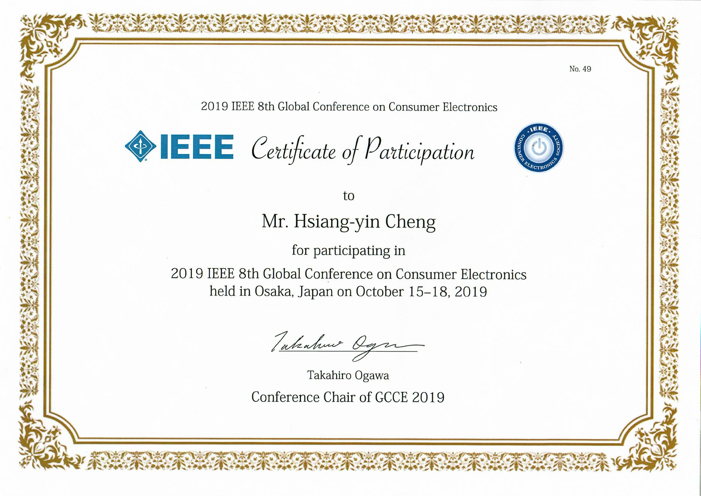
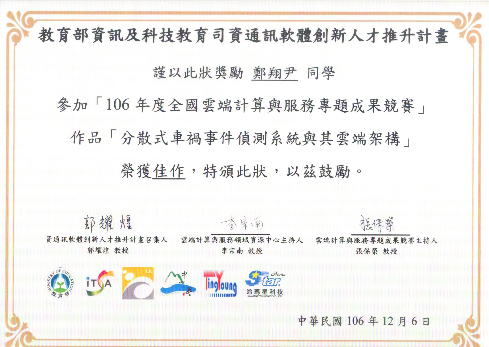
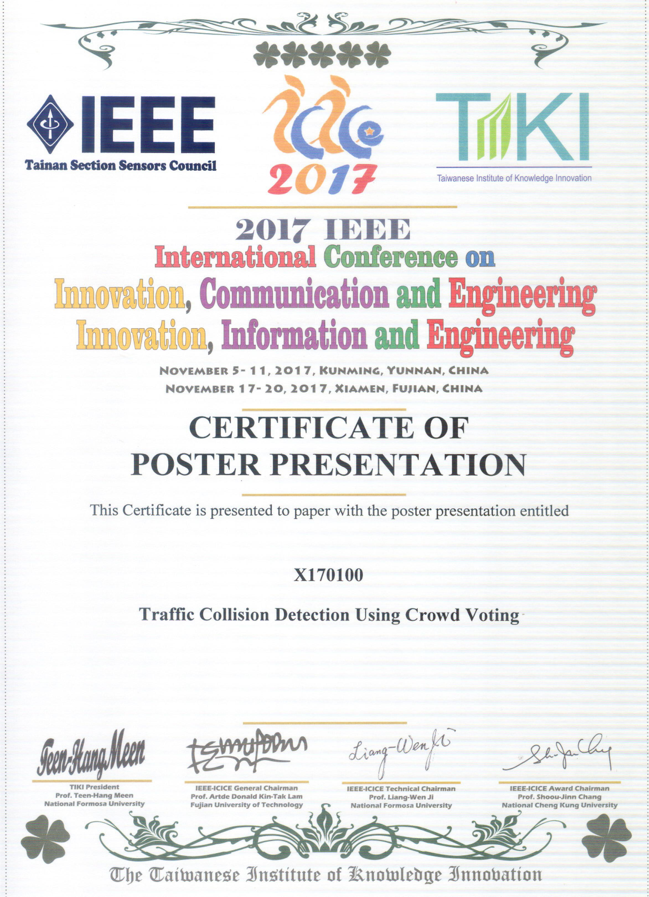
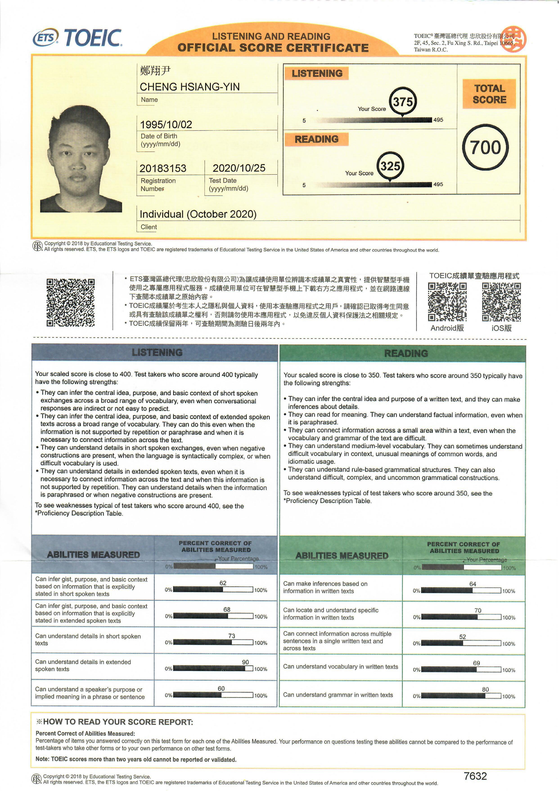
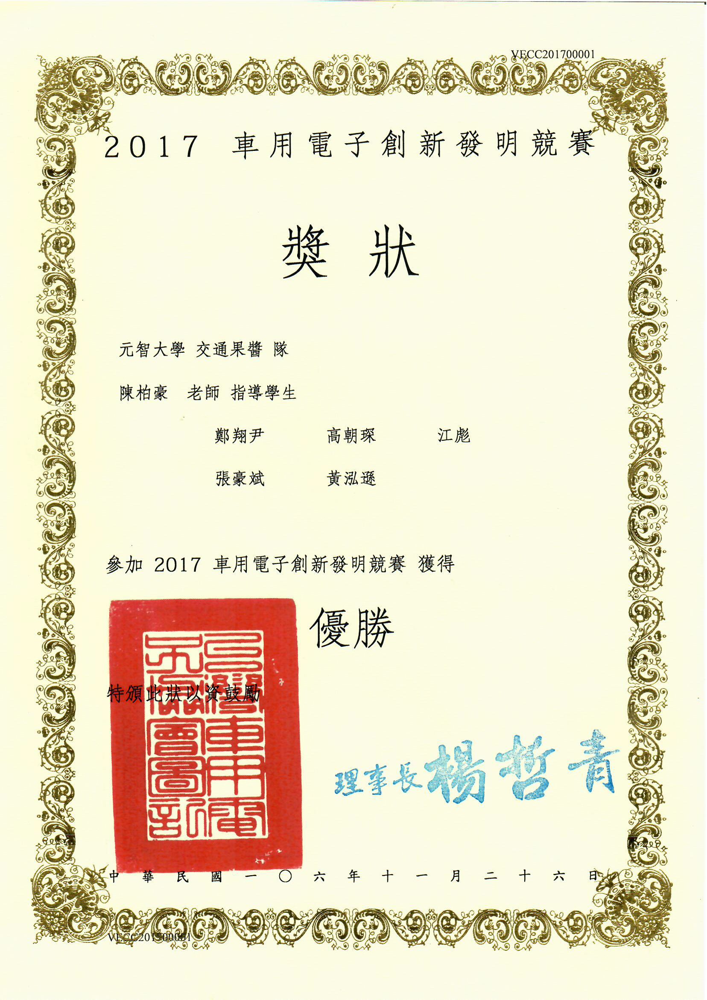
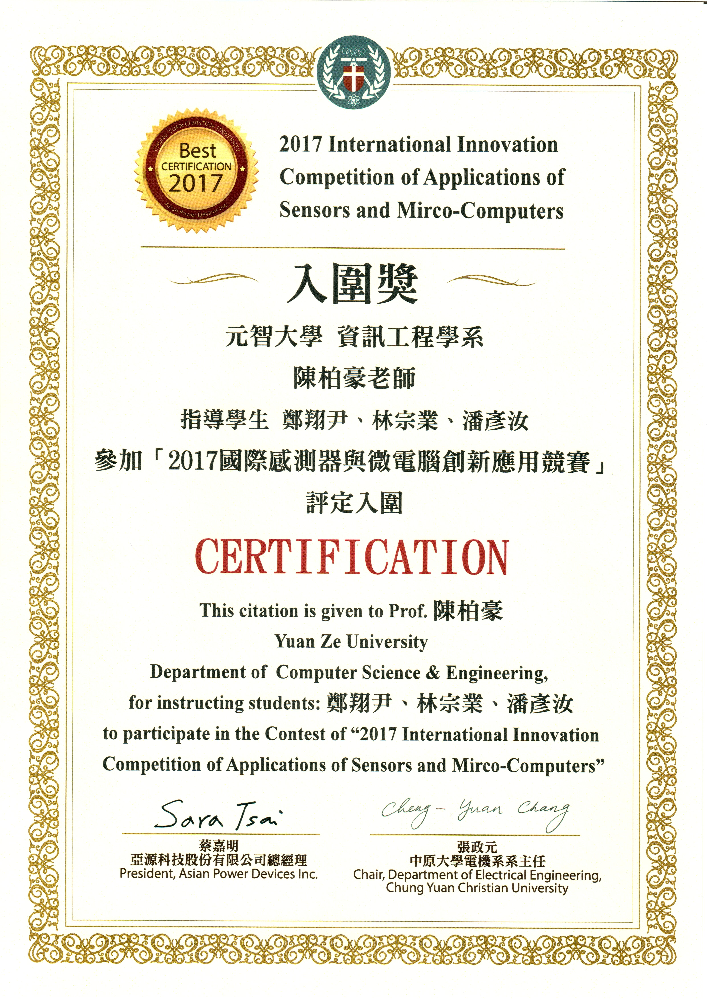

<!--  -->

# About
My name is Cheng Hsiang-Yin. I have passion in computer science. This passion carried me through my education at Yuan-Ze University. My Ph.D. studies have provided me with broad proficiency in the use of computer science engineering methods, techniques, and tools. Alongside this, I experienced computer programmer with academic experience that has published 2 IEEE journal articles, 3 conference articles, and participated in 3 industry-university cooperation projects.  

<!-- 您好，我是鄭翔尹，今年畢業於元智大學資訊工程所博士班。在學期間，發表2篇 IEEE 國際期刊論文和3篇 IEEE 國際會議論文；並參與3個產學合作計畫。主要的研究方向是電腦視覺，和深度學習；並了解物件偵測，監督與非監督式學習，強化學習...等方面知識。 -->

<!-- My name is Cheng Hsiang-Yin. I have passion in computer science. This passion carried me through my education at Yuan-Ze University. My Ph.D. studies have provided me with broad proficiency in the use of computer science engineering methods, techniques, and tools. Alongside this, I experienced computer programmer with academic experience that has published 2 IEEE journal articles, 3 conference articles, and participated in 3 industry-university cooperation projects.
 -->
My research interests are in the broad area of computer vision, artificial intelligence, and image processing. Specifically, I have extensive experience in the following research areas: object recognition and detection, machine learning, deep learning, supervised and unsupervised learning, image super-resolution, and able to write the following specialties languages: Python, Matlab, C++, and Java.

您好，我是鄭翔尹，今年畢業於元智大學資訊工程所博士班。在學期間，發表2篇 IEEE 國際期刊論文和3篇 IEEE 國際會議論文；並參與3個產學合作計畫。主要的研究方向是電腦視覺，和深度學習；並了解物件偵測，監督與非監督式學習，強化學習...等方面知識。

## Skill

### Programming Languages
- Python (approx. 5+ years experience. Mainly used)
- Matlab (approx. 3+ years experience)
- C++ (approx. 1+ years experience)
- Java (approx. 1+ years experience)

### Deep Learning
- Familiar with deep learning frameworks like：TensorFlow、Keras、Scikit Learn.
- Familiar with deep learning techniques like：CNN、RNN、GAN、DQN、A2C、A3C.
- Experience with deep learning applications like：
  - Object Detection & Recognition,
  - Object Localization,
  - Object Classification,
  - Semantic Segmentation ... and so on.

## Education
### Doctor of Philosophy ( Sep 2018 - Sep 2021 )
Department of Computer Science and Engineering, Yuan Ze University

### Bachelor of Science ( Sep 2014 - Jun 2018 )
Department of Computer Science and Engineering, Yuan Ze University

## Publications

### Journal Articles
1. B.-H. Chen, S.-T. Ye, J.-L. Yin, **H.-Y. Cheng** and, D. Chen, "Deep Trident Decomposition Network for Single License Plate Image Glare Removal," IEEE Transactions on Intelligent Transportation, 2021. (In press) [[pdf]](https://ieeexplore.ieee.org/document/9357944) [[code]](https://github.com/bigmms/chen_tits21) [[dataset]](https://bigmms.github.io/chen_tits21_dataset/)

2. B.-H. Chen, **H.-Y. Cheng**, Y.-S. Tseng and J.-L. Yin, "Two-Pass Bilateral Smooth Filtering for Remote Sensing Imagery," IEEE Geoscience and Remote Sensing Letters, 2021. (In press) [[pdf]](https://ieeexplore.ieee.org/document/9325516) [[code]](https://github.com/bigmms/chen_grsl21_tpbf)

### Conference Proceedings
1. B. Chen, **H. Cheng** and J. Yin, "Adaptive Actor-Critic Bilateral Filter," IEEE International Conference on Acoustics, Speech and Signal Processing , pp. 1675-1679, 2022. [[pdf]](https://ieeexplore.ieee.org/document/9746631)

2. **H. Cheng**, J. Yin, B. Chen and Z. Yu, "Smoke 100k: A Database for Smoke Detection," IEEE Global Conference on Consumer Electronics, Osaka, Japan, pp. 596-597, 2019. [[pdf]](https://ieeexplore.ieee.org/document/9015309) [[dataset]](https://bigmms.github.io/cheng_gcce19_smoke100k/)

3. Y. Pan, B. Chen, Z. Lin and **H. Cheng**, "Traffic Collision Detection Using Crowd Voting," International Conference on Information, Communication and Engineering, Xiamen, China, pp. 274-277, 2017. [[pdf]](https://ieeexplore.ieee.org/document/8479158)

## Experience

### Research Assistant ( Sep 2018 - Sep 2021 )
The Multi Media Big Data System Lab, Yuan Ze University
- **3** paper submitted to IEEE TITS, IEEE GRSL and IEEE ICASSP.
  - Developed a deep trident decomposition network for single license plate image glare removal.
  - Developed an unsupervised learning model for single image haze removal.
  - Developed an edge‑preserving image smoothing method.

### Research Assistant ( Sep 2020 - Nov 2020 )
臻鼎科技股份有限公司
- Industry‑University Cooperation Projects ：**Health Card Reader**.
  - Developed a machine learning‑based framework for detecting and analyzing the health level from WeChat app.

### Research Assistant ( Sep 2018 - Aug 2019 )
遠通電收股份有限公司
- Industry‑University Cooperation Projects ：**Maintenance Efficiency: False Trigger Detection**.
  - Developed a machine learning‑based framework for detecting and analyzing the false triggers in electronic toll collection system.
  - Developed data visualization tools for visualizing the framework in electronic toll collection system.

### Research Assistant ( Jan 2019 - Mar 2019 )
禾伸堂企業股份有限公司
- Industry‑University Cooperation Projects ：**Employee Orientation： Python, Data Analysis, and AI**.
  - Design Python programming textbooks.
  - Design course materials such as object detection, image classification, semantic segmentation...etc.

## Honors & Awards
 

  

## Contact

Please contact me on my [email](mailto:qwaszx841002@gmail.com), and here is my [Linkedin profile](www.linkedin.com/in/joe66-zheng).

<!--  -->

              

<!-- Default Statcounter code for cheng_gcce19_smoke100k
https://bigmms.github.io/cheng_gcce19_smoke100k/ -->

<noscript>

</noscript>
<!-- End of Statcounter Code -->

<!-- 由 Google 結構化資料標記協助工具產生的 JSON-LD 標記。 -->

