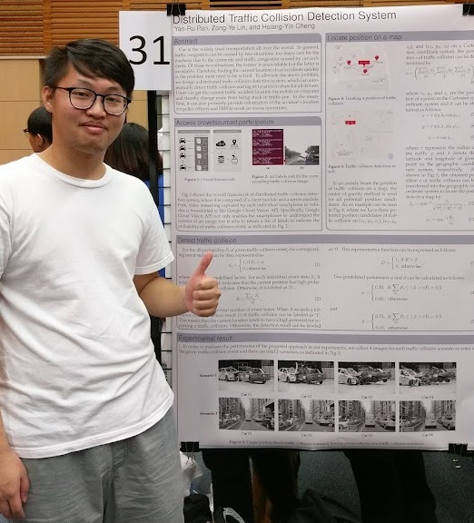
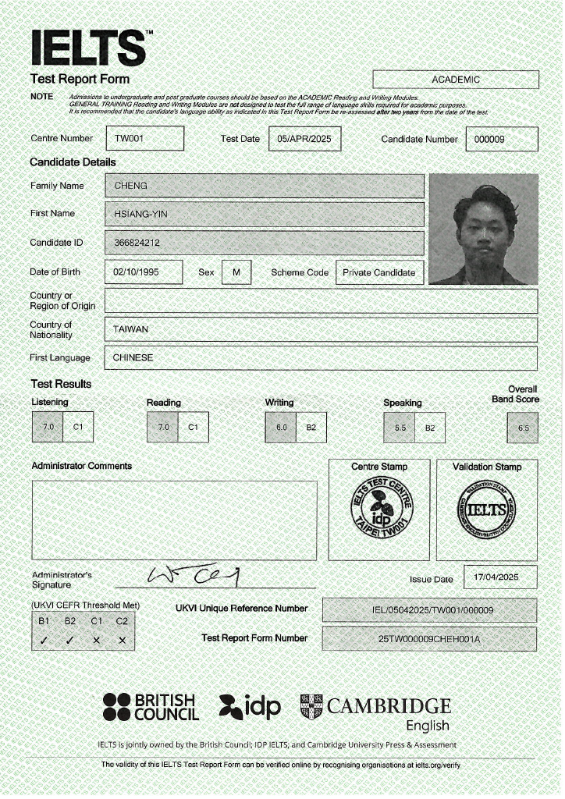

<!--  -->

# About

I am currently pursuing an MSc in Data Science at King’s College London, building upon my strong foundation in artificial intelligence, deep learning, and computer vision. I obtained my Ph.D. in Engineering from Yuan Ze University, Taiwan, in 2021.

Before returning to academia, I worked as a Senior Engineer at Retronix Technologies, Inc., where I developed AI-based Advanced Driver Assistance Systems (ADAS) on the Renesas R-Car V3H SoC. My work focused on driver behavior detection, FaceID systems, and blind spot detection, integrating computer vision models into embedded environments.

I am passionate about applying machine learning and data analysis techniques to solve practical problems and uncover meaningful insights from complex data.

<!-- My name is **Cheng Hsiang-Yin**. I obtained my Ph.D. from Yuan Ze University in 2021. My research interests are in the broad area of **artificial intelligence**, **deep learning**, **computer vision**, and **image processing**. Specifically, I have extensive experience in the following research areas: object recognition and detection, supervised and unsupervised learning, reinforcement learning. My Ph.D. studies have experienced computer programmer with academic experience that has published 2 IEEE journal articles, 4 conference articles.  

Currently working as a **Senior Engineer** in the Automotive Systems Department of **Retronix** Technologies, Inc. and is responsible for developing AI-based ADAS applications on the **#Renesas R-Car V3H SoC**. We have completed the following **ADAS** projects: Driving behavior detection, FaceID system...and so on.-->

## Work & Intership Experience
### Retronix Technologies, Inc – Taipei, Taiwan
***Senior Engineer (Cross-functional Team of 10-20) | Jun 2022 – Dec 2024***
- Developed AI-based ADAS applications on Renesas SoC, including Driver Fatigue Detection, Face Recognition, Traffic Light & Speed Limit Detection, and Blind Spot Detection.
- Built and annotated a large-scale image database; designed automated annotation tools to improve labeling efficiency.
- Trained and pruned deep learning models (PyTorch) to meet SoC computational constraints, reducing resource usage.
- Optimized image preprocessing and integrated ADAS systems in collaboration with cross-functional teams.
- Applied Generative AI to mitigate data imbalance and reduce manual data collection efforts.
- Demonstrated AI-based ADAS applications.
	- Driver Monitoring System with FaceID system. [[demo video]](https://www.linkedin.com/posts/jonastsai_renesas-retronix-renesas-activity-7105850574679527424-aQfD?utm_source=share&utm_medium=member_android)
	- Blind Spot Detection System. [[Introduction video]](https://www.linkedin.com/posts/jonastsai_retronix-computex2024-bsd-activity-7203576194854789121-MwXC?utm_source=share&utm_medium=member_android) [[demo video]](https://www.linkedin.com/posts/jonastsai_ai-v3h2-bsd-activity-7226512358691549185-01dC?utm_source=share&utm_medium=member_android) 
 
### The Multi Media Big Data System Lab, Yuan Ze University – Zhongli, Taiwan
***Research Assistant | Sept 2018 – Sept 2021 | [Google Scholar](https://scholar.google.com/citations?hl=en&view_op=list_works&gmla=AKzYXQ3H-MIUycvysgb7HWvkDqjyfE6yP47YLdTWdnPxcGPSGguLsLp7rO4NJ6eHOd_u43--_F0EaiTsFYBhKA&user=ip2j7REAAAAJ) | [GitHub](https://github.com/qwe12345113)***
- Published 2 IEEE journal papers and 4 conference papers on image processing and deep learning applications.
- Developed a deep tripartite decomposition network for glare removal in license plate images, leveraging deep learning to enhance image clarity.
- Applied edge-preserving smoothing and denoising techniques for remote sensing images.
- Built large-scale databases for smoke and solar glare images, providing high-quality annotated data for AI-based image restoration and machine learning research.

### Zhen Ding Tech. Group – Taoyuan, Taiwan
***Research & Development, Health Information Card Reader | Sept 2020 – Nov 2020***
- Collaborated on an industry-academia project to develop a health information card reader for improved epidemic prevention.
- Implemented automatic card identification and analysis using OpenCV and OCR, ensuring accurate compliance checks.
- Applied image processing and text recognition techniques to enhance data processing efficiency and accuracy.

### Far Eastern Electronic Toll Collection Co., Ltd – New Taipei City, Taiwan
***Research & Development, ETC Detection System | Sept 2018 – Aug 2019***
- Led development of a false trigger detection system for ETC gantries using Python and Scikit-Learn, automating the detection of misfiring events.
- Built a data visualization tool with Django and MySQL for real-time monitoring and analysis of gantry misfires.
- Integrated detection and visualization tools to reduce field data collection, lowering operational costs and improving efficiency.

### Holy Stone Enterprise Co., Ltd. – Taipei, Taiwan
***Research Assistant, AI Educational Training Program | Jan 2019 – Mar 2019***
- Assisted in designing Python programming and AI curriculum, covering object detection and classification.
- Conducted training sessions to promote AI development trends and equip employees with practical AI skills.

## Academic Background
### Master of Science ( Sep 2025 – Present )
Department of Informatics, King’s College London, London, United Kingdom
- Programme: Data Science
- Focusing on data analytics

### Doctor of Philosophy ( Sep 2018 - Sep 2021 )
Department of Computer Science and Engineering, Yuan Ze University, Taoyuan, Taiwan
- Programme: Computer Science
- Focusing on machine learning, computer vision, and applied AI
- Dissertation title : Trustable AI: A Study on Noise-Tolerant Image Filters for Edge-preserving Smoothing
- Overall GPA 3.71/4.0

### Bachelor of Science ( Sep 2014 - Jun 2018 )
Department of Computer Science and Engineering, Yuan Ze University, Taoyuan, Taiwan
- Programme: Computer Science

## Skill
### Programming & Languages
- Python (main), Matlab, C++, Java

### Deep Learning
- Frameworks: TensorFlow, Keras, PyTorch, ONNX
- Techniques: CNN, RNN, GAN, DQN, A2C, A3C
- Applications: Object Detection, Recognition, Classification, Semantic Segmentation

## Publications <!--[<a href="https://scholar.google.com/citations?hl=en&view_op=list_works&gmla=AKzYXQ3H-MIUycvysgb7HWvkDqjyfE6yP47YLdTWdnPxcGPSGguLsLp7rO4NJ6eHOd_u43--_F0EaiTsFYBhKA&user=ip2j7REAAAAJ" target="_blank">Google Scholar</a>]-->
### Journal Articles
1. B. -H. Chen, S. Ye, J. -L. Yin, **H. -Y. Cheng** and D. Chen, "Deep Trident Decomposition Network for Single License Plate Image Glare Removal," in IEEE Transactions on Intelligent Transportation Systems, vol. 23, no. 7, pp. 6596-6607, July 2022. [[pdf]](https://ieeexplore.ieee.org/document/9357944) [[code]](https://github.com/bigmms/chen_tits21) [[dataset]](https://bigmms.github.io/chen_tits21_dataset/)

2. B. -H. Chen, **H. -Y. Cheng**, Y. -S. Tseng and J. -L. Yin, "Two-Pass Bilateral Smooth Filtering for Remote Sensing Imagery," in IEEE Geoscience and Remote Sensing Letters, vol. 19, pp. 1-5, May 2022. [[pdf]](https://ieeexplore.ieee.org/document/9325516) [[code]](https://github.com/bigmms/chen_grsl21_tpbf)

### Conference Proceedings
1. Y. -J. Chen, Y. -C. Wang, B. -H. Chen, **H. -Y. Cheng** and J. -L. Yin, "Actor-Critic Bilateral Filter for Noise-Robust Image Smoothing," 2022 IEEE International Symposium on Multimedia (ISM), Italy, 2022, pp. 273-277. [[pdf]](https://ieeexplore.ieee.org/document/10019656)

2. B. Chen, **H. Cheng** and J. Yin, "Adaptive Actor-Critic Bilateral Filter," ICASSP 2022 - 2022 IEEE International Conference on Acoustics, Speech and Signal Processing (ICASSP), Singapore, Singapore, 2022, pp. 1675-1679. [[pdf]](https://ieeexplore.ieee.org/document/9746631)

3. **H. -Y. Cheng**, J. -L. Yin, B. -H. Chen and Z. -M. Yu, "Smoke 100k: A Database for Smoke Detection," 2019 IEEE 8th Global Conference on Consumer Electronics (GCCE), Osaka, Japan, 2019. [[pdf]](https://ieeexplore.ieee.org/document/9015309) [[dataset]](https://bigmms.github.io/cheng_gcce19_smoke100k/)

4. Y. Pan, B. Chen, Z. Lin and **H. Cheng**, "Traffic Collision Detection Using Crowd Voting," International Conference on Information, Communication and Engineering, Xiamen, China, pp. 274-277, 2017. [[pdf]](https://ieeexplore.ieee.org/document/8479158)

## Honors & Awards
 

<a href="https://github.com/qwe12345113/Resume/blob/main/figures/IELTS_score_Hsiang-Yin_CHENG.pdf" title="">  </a>  

## language
- Chinese：Native proficiency
- English：Professional working proficiency
  - IELTS(Academic 2025): Overall Band 6.5 

## Contact
Please feel free to contact me <!-- on my Email：[myworkac38610@gmail.com](mailto:myworkac38610@gmail.com)-->

<!-- * Follow me on [Linkedin profile](http://www.linkedin.com/in/joe66-zheng) and [github page](https://github.com/qwe12345113). -->

<!--  -->

              

<!-- Default Statcounter code for cheng_gcce19_smoke100k
https://bigmms.github.io/cheng_gcce19_smoke100k/ -->

<noscript>

</noscript>
<!-- End of Statcounter Code -->

<!-- 由 Google 結構化資料標記協助工具產生的 JSON-LD 標記。 -->

